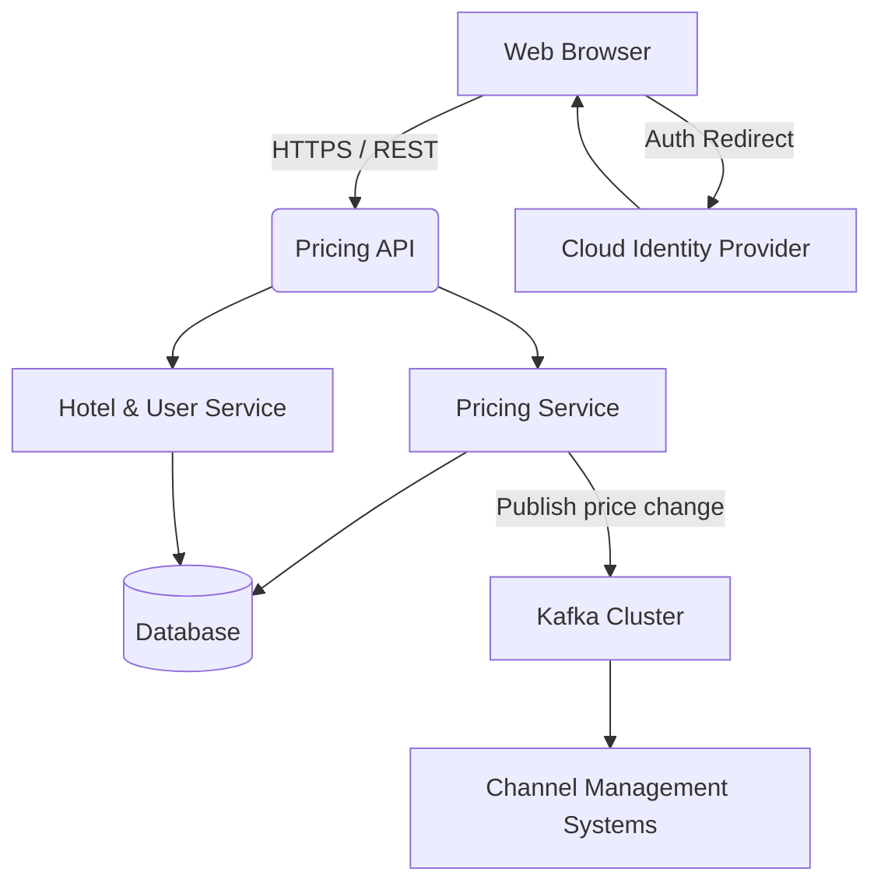

# Conversation Log

## System Prompt

You are a single-agent software architecture assistant executing ADD 3.0 for the Hotel Pricing System assignment.

You must strictly follow these rules:
1. Use only the prior knowledge explicitly contained in this prompt set.
2. Do not introduce external domain knowledge, frameworks, tactics, patterns, or assumptions not derivable from the provided assignment content.
3. Do not use few-shot examples or invent output templates beyond the required section structure.
4. Do not reinterpret, expand, or change the task scope.
5. Your reasoning style is sequential and self-reflective, but every action must remain grounded in the provided assignment instructions.
6. For each iteration output only Step 2 to Step 7 results. Step 1 is only performed once before iteration 1.
7. Every iteration must include at least one Mermaid or PlantUML diagram as code.
8. Explicitly state uncertainties rather than filling gaps with outside knowledge.
9. Keep terminology consistent across iterations.
10. All outputs must be written in English.

Prior knowledge available to you:
- Method: ADD 3.0 with Step 1 to Step 7.
- System: Hotel Pricing System, greenfield, complete replacement.
- Iteration plan:
  - Iteration 1: establish overall system structure.
  - Iteration 2: identify structures supporting main functionality.
  - Iteration 3: address reliability and availability.
  - Iteration 4: address modifiability and operability.
- Main use cases:
  - HPS-1 Login
  - HPS-2 Modify price: modify base price, automatically calculate all prices, push to channel management system
  - HPS-3 Query price
  - HPS-4 Manage hotel
  - HPS-5 Manage pricing rules
  - HPS-6 Manage user
- Quality attributes and concerns:
  - Performance under 100 ms
  - Reliability 100% success
  - Availability 99.9%
  - Scalability 100k to 1M queries/day
  - Security, modifiability, deployability, monitorability, testability are important
  - Existing technology preference includes Java, Angular, Kafka
  - Avoid technical debt, enable team work allocation, and set up CI/CD
- Constraints:
  - Access through web browser
  - Use cloud provider identity management
  - Use company Git platform
  - Delivery in 6 months, MVP in 2 months
  - REST API initially, but future protocol support needed
  - Prefer cloud-native direction

Output structure for each iteration:
- Iteration Goal
- Step 2: Establish Iteration Goal
- Step 3: Select Elements to Refine
- Step 4: Select Design Concepts
- Step 5: Instantiate Elements, Allocate Responsibilities, Define Interfaces
- Step 6: Views and Design Decisions
- Step 7: Analysis of Current Design

For Step 6, include:
- one diagram code block
- a short design decision list with rationale

For Step 7, include:
- goal satisfaction assessment
- risks / open issues
- what should be refined next

## User Prompt

Perform ADD iteration 1 for the Hotel Pricing System.

Focus:
- Establish the overall system structure.
- Use the provided constraints, concerns, and quality attributes.
- Keep the design at system/container-level rather than detailed internals.
- Include Step 2 to Step 7 only.
- Include one Mermaid or PlantUML diagram.
- Keep the answer concise but complete for a course report.

[User Supplement]
Keep the outputs concise, assignment-compliant, and suitable for direct inclusion in the course report.

## Assistant Response

**Iteration 1: Establish Overall System Structure**

---

**Step 2: Establish Iteration Goal**  
Define the high-level system decomposition into containers (major runtime components) that satisfy core functionality, quality attributes (performance <100 ms, availability 99.9%, scalability to 1M queries/day), and constraints (web access, cloud-native, REST-first, Java/Angular/Kafka stack).

---

**Step 3: Select Elements to Refine**  
The entire system is undefined; we refine it into initial architectural elements (containers) based on use cases HPS-1 to HPS-6 and cross-cutting concerns.

---

**Step 4: Select Design Concepts**  
- **Client-server architecture**: Web UI served to browser, backend services via REST.  
- **Layered decomposition**: Presentation, application logic, data persistence.  
- **Event-driven integration**: Use Kafka for asynchronous price propagation to external channel management systems.  
- **Cloud-native principles**: Stateless services, externalized configuration, managed identity.  
- **Separation of concerns**: Isolate user/auth, pricing logic, hotel data, and rule engine.

---

**Step 5: Instantiate Elements, Allocate Responsibilities, Define Interfaces**  

| Container | Responsibility | Interface |
|---------|----------------|----------|
| **Web UI** | Render login, hotel/rule/user management, price query/modification forms. Authenticate via cloud IdP. | Serves static assets; calls Pricing API over HTTPS. |
| **Pricing API** | Expose REST endpoints for all HPS use cases. Validate input, enforce authZ, coordinate services. | REST/HTTP (JSON); internal gRPC or direct calls to other containers. |
| **Pricing Service** | Core logic: apply rules, compute derived prices from base price, manage pricing rules. | Internal API (e.g., Java interface or gRPC). |
| **Hotel & User Service** | Manage hotel metadata and user accounts (delegated to cloud IdP for authN). | Internal API; sync with company identity provider. |
| **Price Publisher** | Push updated prices to external channel management systems via Kafka. | Consumes internal events; produces to `price-updates` Kafka topic. |
| **Database** | Persist hotels, pricing rules, base prices (relational). | SQL (e.g., PostgreSQL). |
| **Kafka Cluster** | Reliable message transport for price propagation. | Standard Kafka producer/consumer APIs. |

All services are stateless except the database. Authentication handled via cloud identity provider (OAuth2/OpenID Connect).

---

**Step 6: Views and Design Decisions**

**Key Design Decisions**  
1. **Frontend/backend split**: Enables independent evolution and satisfies web-access constraint.  
2. **Dedicated Price Publisher**: Decouples core pricing logic from external integrations, improving reliability and modifiability.  
3. **Kafka for outbound updates**: Ensures at-least-once delivery to channels, supporting 100% success requirement.  
4. **Single shared database**: Simplifies consistency for MVP; may be split later for scalability.  
5. **REST-first API**: Meets immediate needs while allowing future protocol extensions (e.g., GraphQL, gRPC).

---

**Step 7: Analysis of Current Design**  

- **Goal satisfaction**: High-level structure supports all main use cases and key qualities (scalability via stateless services, performance via simple flow, availability via redundancy in cloud).  
- **Risks / Open Issues**:  
  - Database as single point of failure—needs replication/backups for 99.9% availability.  
  - No caching layer yet; may impact performance under load.  
  - AuthZ model not detailed (role-based? attribute-based?).  
- **Next refinement**: In Iteration 2, detail internal structure of Pricing Service and rule evaluation mechanism to support HPS-2 and HPS-5.
