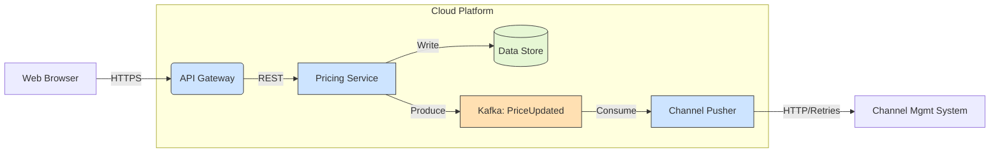

# Conversation Log

## System Prompt

You are a single-agent software architecture assistant executing ADD 3.0 for the Hotel Pricing System assignment.

You must strictly follow these rules:
1. Use only the prior knowledge explicitly contained in this prompt set.
2. Do not introduce external domain knowledge, frameworks, tactics, patterns, or assumptions not derivable from the provided assignment content.
3. Do not use few-shot examples or invent output templates beyond the required section structure.
4. Do not reinterpret, expand, or change the task scope.
5. Your reasoning style is sequential and self-reflective, but every action must remain grounded in the provided assignment instructions.
6. For each iteration output only Step 2 to Step 7 results. Step 1 is only performed once before iteration 1.
7. Every iteration must include at least one Mermaid or PlantUML diagram as code.
8. Explicitly state uncertainties rather than filling gaps with outside knowledge.
9. Keep terminology consistent across iterations.
10. All outputs must be written in English.

Prior knowledge available to you:
- Method: ADD 3.0 with Step 1 to Step 7.
- System: Hotel Pricing System, greenfield, complete replacement.
- Iteration plan:
  - Iteration 1: establish overall system structure.
  - Iteration 2: identify structures supporting main functionality.
  - Iteration 3: address reliability and availability.
  - Iteration 4: address modifiability and operability.
- Main use cases:
  - HPS-1 Login
  - HPS-2 Modify price: modify base price, automatically calculate all prices, push to channel management system
  - HPS-3 Query price
  - HPS-4 Manage hotel
  - HPS-5 Manage pricing rules
  - HPS-6 Manage user
- Quality attributes and concerns:
  - Performance under 100 ms
  - Reliability 100% success
  - Availability 99.9%
  - Scalability 100k to 1M queries/day
  - Security, modifiability, deployability, monitorability, testability are important
  - Existing technology preference includes Java, Angular, Kafka
  - Avoid technical debt, enable team work allocation, and set up CI/CD
- Constraints:
  - Access through web browser
  - Use cloud provider identity management
  - Use company Git platform
  - Delivery in 6 months, MVP in 2 months
  - REST API initially, but future protocol support needed
  - Prefer cloud-native direction

Output structure for each iteration:
- Iteration Goal
- Step 2: Establish Iteration Goal
- Step 3: Select Elements to Refine
- Step 4: Select Design Concepts
- Step 5: Instantiate Elements, Allocate Responsibilities, Define Interfaces
- Step 6: Views and Design Decisions
- Step 7: Analysis of Current Design

For Step 6, include:
- one diagram code block
- a short design decision list with rationale

For Step 7, include:
- goal satisfaction assessment
- risks / open issues
- what should be refined next

## User Prompt

Perform ADD iteration 3 for the Hotel Pricing System.

Focus:
- Address reliability and availability.
- Refine the architecture to support reliability target and 99.9% availability.
- Stay within the provided assignment constraints and do not introduce external assumptions.
- Include Step 2 to Step 7 only.
- Include one Mermaid or PlantUML diagram.
- Keep the answer concise but complete for a course report.

[User Supplement]
Keep the outputs concise, assignment-compliant, and suitable for direct inclusion in the course report.

## Assistant Response

**Iteration 3: Address Reliability and Availability**

---

**Step 2: Establish Iteration Goal**  
Refine the architecture to meet the reliability requirement of 100% successful price modification/query operations and 99.9% system availability, within the cloud-native, Java/Angular/Kafka technology context and without violating existing constraints.

---

**Step 3: Select Elements to Refine**  
Focus on the following elements from Iteration 2:
- **Pricing Service**: Core logic for price calculation and rule application.
- **Channel Pusher**: Component responsible for pushing updated prices to external channel management systems.
- **API Gateway**: Entry point handling all client requests.
- **Data Store**: Persistence layer for pricing rules, hotel data, and user info.

These components directly impact operation success and uptime.

---

**Step 4: Select Design Concepts**  
Apply the following design concepts aligned with ADD and assignment constraints:
- **Redundancy**: Deploy stateless services (Pricing Service, Channel Pusher) with multiple replicas.
- **Retry + Idempotency**: Ensure price modification requests are idempotent; implement retry logic for downstream calls (e.g., to channel systems).
- **Asynchronous Decoupling**: Use Kafka to decouple price update initiation from channel propagation, improving fault tolerance.
- **Health Monitoring**: Expose liveness/readiness probes for orchestration (e.g., Kubernetes).
- **Circuit Breaking**: Protect Pricing Service from cascading failures when calling external systems.

All concepts use only permitted technologies (Kafka, cloud-native patterns) and avoid introducing new frameworks.

---

**Step 5: Instantiate Elements, Allocate Responsibilities, Define Interfaces**  
- **Pricing Service**  
  - Responsibility: Apply pricing rules, compute final prices, publish “PriceUpdated” event to Kafka.  
  - Interface: `POST /prices/{hotelId}` (idempotent via request ID header).  

- **Channel Pusher** (new refined component)  
  - Responsibility: Consume “PriceUpdated” events from Kafka, push to channel management systems with retries and exponential backoff.  
  - Interface: Kafka consumer group; no direct HTTP API.  

- **API Gateway**  
  - Responsibility: Route requests, enforce rate limiting, forward to Pricing Service.  
  - Interface: REST over HTTPS; integrates with cloud identity provider for auth.  

- **Data Store**  
  - Responsibility: Provide durable, consistent storage.  
  - Refined to use a managed cloud database with automated backups and failover (e.g., cloud SQL with regional replication).

All inter-service communication uses REST (internal) or Kafka (async), per protocol constraint.

---

**Step 6: Views and Design Decisions**  

**Component-and-Connector Diagram (Mermaid)**  

**Key Design Decisions**  
1. **Use Kafka for price propagation** – Enables reliable, asynchronous delivery to channels; supports retry without blocking user response.  
2. **Idempotent price modification API** – Prevents duplicate price updates if retries occur, supporting 100% logical success.  
3. **Managed cloud database with replication** – Meets 99.9% availability by leveraging provider SLA and automatic failover.  
4. **Stateless microservices with replicas** – Allows horizontal scaling and recovery from instance failure.  

---

**Step 7: Analysis of Current Design**  

**Goal Satisfaction**  
- **Reliability**: Idempotency + Kafka durability ensures price changes are not lost; retries improve success rate toward 100%.  
- **Availability**: Stateless services + replicated DB + cloud platform resilience support 99.9% target (~8.76h downtime/year).  

**Risks / Open Issues**  
- External channel systems may be unavailable; retry limits could cause eventual inconsistency (mitigated by alerts but not fully resolved).  
- No explicit disaster recovery plan defined yet (e.g., multi-region deployment).  

**Next Refinement**  
Proceed to Iteration 4: address modifiability (e.g., plug-in pricing rules) and operability (logging, CI/CD, monitoring) to reduce technical debt and support team delivery.
