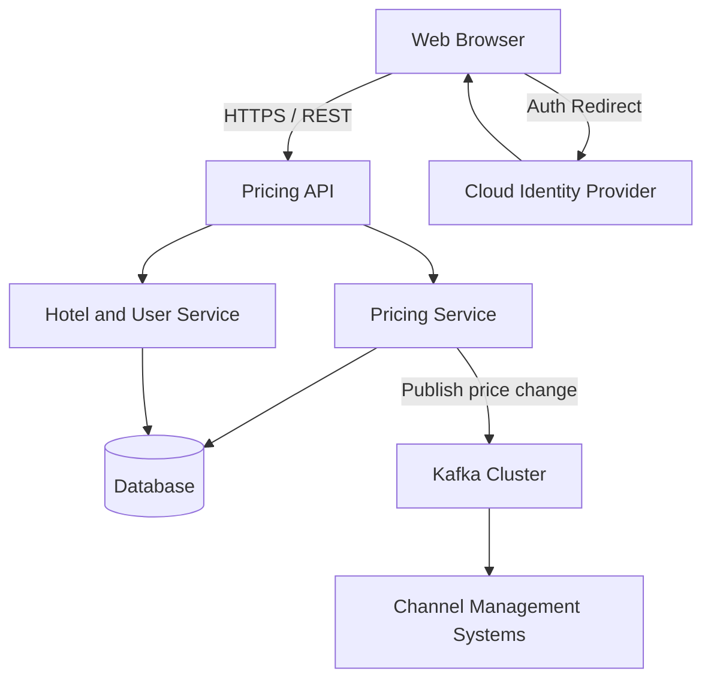
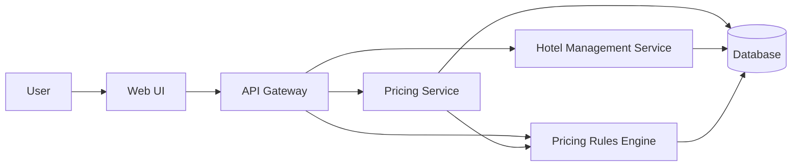
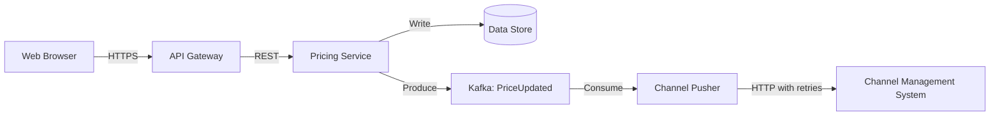
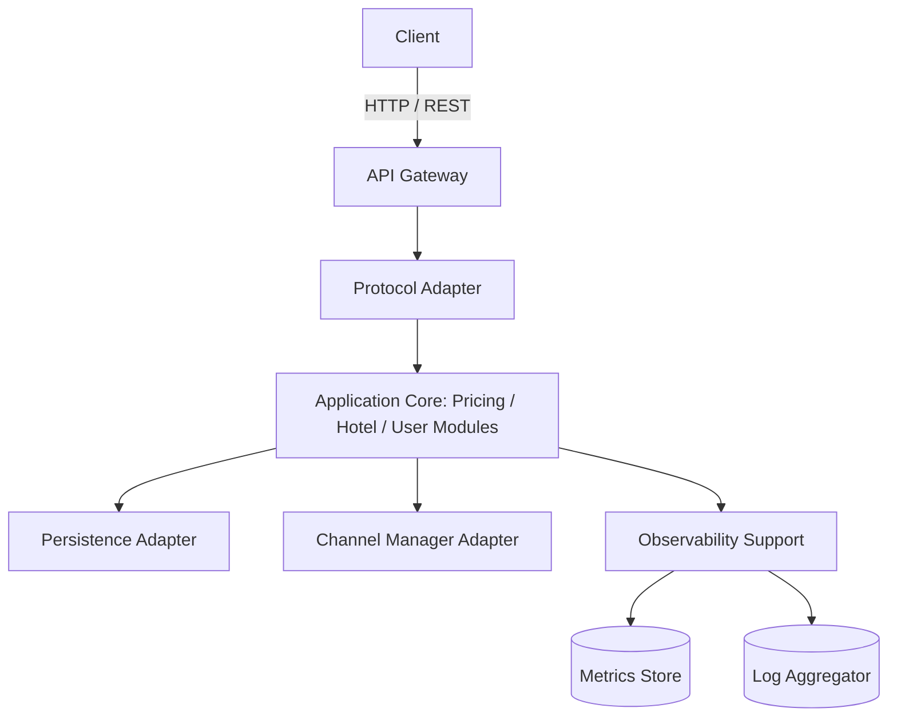

# Assignment 2 Report

## Basic Information
- Paradigm: Single Agent
- LLM: Qwen3-Max
- System: Hotel Pricing System
- Method: ADD 3.0

## 1. Output Results of ADD

### Step 1 Review of Inputs
The initial input review identified the main architectural drivers of the Hotel Pricing System (HPS).

- Functional drivers:
  - HPS-1 Login
  - HPS-2 Modify price
  - HPS-3 Query price
  - HPS-4 Manage hotel
  - HPS-5 Manage pricing rules
  - HPS-6 Manage user
- Quality attribute drivers:
  - Performance: response time below 100 ms
  - Reliability: 100% successful execution of key operations
  - Availability: 99.9%
  - Scalability: 100k to 1M queries per day
  - Security, modifiability, deployability, monitorability, and testability
- Constraints:
  - Web-browser access
  - Cloud-provider identity management
  - Company Git platform
  - Delivery in 6 months with an MVP in 2 months
  - REST API first, with future protocol extensibility
  - Cloud-native preference
- Concerns:
  - Establish an initial structure quickly
  - Reuse the preferred technology stack (Java, Angular, Kafka)
  - Support team work allocation
  - Avoid technical debt
  - Enable CI/CD

### Iteration 1
#### Iteration Goal
Establish the overall system structure and define a high-level decomposition that supports the major use cases, required quality attributes, and project constraints.

#### Step 2 Establish Iteration Goal
Define the high-level system decomposition into major runtime containers that satisfy:
- the main use cases,
- performance below 100 ms,
- availability of 99.9%,
- scalability up to 1M queries per day,
- and the cloud-native, REST-first, browser-based constraints.

#### Step 3 Select Elements to Refine
At this stage, the system had not yet been decomposed. Therefore, the whole system was selected for initial refinement into major architectural containers.

#### Step 4 Select Design Concepts
The following design concepts were selected:
- Client-server architecture for browser-based access
- Layered decomposition for clear separation between presentation, logic, and persistence
- Event-driven integration using Kafka for price propagation
- Cloud-native stateless service design
- Separation of concerns across pricing, hotel/user management, and outbound channel integration

#### Step 5 Instantiate Elements, Allocate Responsibilities, Define Interfaces

| Container | Responsibility | Interface |
| --- | --- | --- |
| Web UI | Provides browser-based interaction for login, hotel management, rule management, price query, and price modification | HTTPS / REST |
| Pricing API | Exposes REST endpoints for all major HPS use cases and coordinates backend services | REST/HTTP JSON |
| Pricing Service | Applies pricing rules, computes derived prices, and supports price query and modification | Internal service API |
| Hotel & User Service | Manages hotel metadata and user-related administration | Internal service API |
| Price Publisher | Propagates price updates to external channel systems asynchronously | Kafka producer/consumer |
| Database | Persists hotels, rules, and pricing data | SQL |
| Kafka Cluster | Carries price update events reliably to downstream systems | Kafka APIs |
| Cloud Identity Provider | Handles authentication | OAuth2 / OIDC redirect flow |

#### Step 6 Views and Design Decisions

Key design decisions:
1. Frontend/backend separation supports browser access and independent evolution.
2. A dedicated price publishing path decouples core pricing logic from external integrations.
3. Kafka is used for outbound price updates to improve reliability and support asynchronous propagation.
4. A shared database is acceptable for the MVP because it simplifies consistency management.
5. REST is chosen first because it matches the assignment constraints and can be extended later.

#### Step 7 Analysis of Current Design
- Goal satisfaction:
  - The initial structure supports all listed use cases.
  - Stateless services and asynchronous price propagation support scalability and resilience.
- Risks / Open issues:
  - The database is still a single point of failure.
  - No cache is introduced yet, so high query load may challenge the response-time target.
  - The authorization model is not yet refined.
- What should be refined next:
  - The internal structure around pricing, hotel management, and pricing rules should be refined to support the main business functionality in more detail.

### Iteration 2
#### Iteration Goal
Refine the structures that directly support the main business functionality, especially HPS-2, HPS-3, HPS-4, and HPS-5.

#### Step 2 Establish Iteration Goal
This iteration focuses on refining the application-layer structures responsible for:
- price modification,
- price query,
- hotel management,
- and pricing rule management.

The goal is to define clear responsibilities and interfaces for these core functional elements.

#### Step 3 Select Elements to Refine
The following elements from Iteration 1 were refined:
- Pricing Service
- Hotel Management Service
- Pricing Rules Engine
- Data Access Layer

#### Step 4 Select Design Concepts
The following design concepts were applied:
- Service decomposition aligned with business capabilities
- Separation of concerns between business logic and persistence
- Stateless services for scalability
- Domain-aligned module boundaries

#### Step 5 Instantiate Elements, Allocate Responsibilities, Define Interfaces

| Element | Responsibilities | Key Interfaces |
| --- | --- | --- |
| Pricing Service | Accepts base price changes, triggers recalculation, and provides current/future prices | `PUT /hotels/{id}/base-price`, `GET /hotels/{id}/prices?date=...` |
| Hotel Management Service | Creates, reads, updates, and deletes hotel metadata | `POST /hotels`, `GET /hotels/{id}` |
| Pricing Rules Engine | Stores, retrieves, and applies pricing rules | `PUT /hotels/{id}/rules`, `GET /hotels/{id}/rules` |
| Data Access Layer | Provides transactional persistence abstraction | Repository interfaces |

The Pricing Service uses the Rules Engine during price recalculation. Querying is performed through the same pricing-related structure.

#### Step 6 Views and Design Decisions

Key design decisions:
1. Domain-aligned service decomposition supports clearer responsibilities and future team ownership.
2. The Pricing Service orchestrates recalculation so that UI and persistence layers remain simpler.
3. A shared database with schema-level separation is used for MVP simplicity.
4. Synchronous REST APIs are kept for core operations to align with the response-time target.

#### Step 7 Analysis of Current Design
- Goal satisfaction:
  - The main business use cases are now supported by explicit structural elements.
  - Responsibilities and interfaces are clearer than in Iteration 1.
- Risks / Open issues:
  - The Pricing Service and Rules Engine are still tightly coupled.
  - Caching is still undefined.
  - Concurrency control for simultaneous price updates is not yet detailed.
- What should be refined next:
  - Reliability and availability concerns should be refined next, especially around retries, durability, and failure handling.

### Iteration 3
#### Iteration Goal
Address reliability and availability by refining the architecture to support 100% logical success for core price operations and 99.9% availability.

#### Step 2 Establish Iteration Goal
This iteration focuses on improving reliability and availability for:
- price modification,
- price propagation,
- API entry points,
- and data durability.

#### Step 3 Select Elements to Refine
The following elements were refined:
- Pricing Service
- Channel Pusher
- API Gateway
- Data Store

#### Step 4 Select Design Concepts
The selected design concepts were:
- Redundancy through multiple stateless replicas
- Retry plus idempotency for critical operations
- Asynchronous decoupling via Kafka
- Health monitoring for orchestration
- Circuit-breaking style protection against cascading downstream failures

#### Step 5 Instantiate Elements, Allocate Responsibilities, Define Interfaces
- Pricing Service
  - Applies pricing rules, computes final prices, and publishes `PriceUpdated` events
  - Interface: `POST /prices/{hotelId}` with an idempotency key or request ID
- Channel Pusher
  - Consumes price update events and pushes them to channel management systems with retry logic
  - Interface: Kafka consumer group
- API Gateway
  - Routes requests, performs request-level controls, and integrates with cloud identity
  - Interface: HTTPS REST entry point
- Data Store
  - Provides durable storage with backup and failover expectations

#### Step 6 Views and Design Decisions

Key design decisions:
1. Kafka is retained for reliable asynchronous price propagation.
2. Price modification is designed to be idempotent so that retries do not duplicate logical updates.
3. The data store is expected to use managed replication and automated backup/failover.
4. Stateless replicated services improve service availability and recoverability.

#### Step 7 Analysis of Current Design
- Goal satisfaction:
  - Reliability is improved through idempotency, durable messaging, and retry-based downstream handling.
  - Availability is improved through stateless replication and managed persistence assumptions.
- Risks / Open issues:
  - External channel systems can still be unavailable for extended periods.
  - Disaster recovery is not yet fully defined.
- What should be refined next:
  - Modifiability and operability should be refined next to reduce future change cost and support team delivery.

### Iteration 4
#### Iteration Goal
Address modifiability and operability by improving protocol extensibility, deployment automation, monitoring capability, and work allocation support.

#### Step 2 Establish Iteration Goal
This iteration focuses on:
- enabling future protocol support beyond REST,
- improving module boundaries for team-based development,
- introducing CI/CD and observability capabilities,
- and reducing operational friction in a cloud environment.

#### Step 3 Select Elements to Refine
The following elements were refined:
- API Gateway
- Application Core
- Deployment Units
- Observability Layer

#### Step 4 Select Design Concepts
The following design concepts were applied:
- Hexagonal architecture to decouple core logic from I/O concerns
- Package-by-feature modularization for clearer ownership
- Logical observability sidecar/support layer
- Pipeline-as-code for CI/CD

#### Step 5 Instantiate Elements, Allocate Responsibilities, Define Interfaces
- Protocol Adapters
  - Implement REST now and allow future adapters for other protocols
- Core Modules
  - Organize business logic into pricing, hotel, and user-related modules
- Observability Module
  - Provides structured logging, metrics, and trace propagation
- CI/CD Pipeline
  - Builds, tests, packages, and deploys on the company Git platform

Key interfaces include:
- `PricingRuleRepository`
- `ChannelManagerClient`
- health endpoints
- metrics endpoints

#### Step 6 Views and Design Decisions

Key design decisions:
1. Hexagonal architecture isolates core business logic from protocol and infrastructure changes.
2. Package-by-feature organization supports maintainability and team ownership.
3. Standardized observability endpoints support monitorability and operability.
4. A Git-managed CI/CD pipeline supports deployability and testability.

#### Step 7 Analysis of Current Design
- Goal satisfaction:
  - Modifiability is improved through clear separation between core logic and adapters.
  - Operability is improved through health checks, metrics, and CI/CD structure.
- Risks / Open issues:
  - Adapter interfaces must remain stable as more protocols are added.
  - Observability data volume may become expensive under heavy traffic.
- What should be refined next:
  - A fuller error-handling policy across adapters and operational validation under realistic load should be added in future work.

## 2. Interaction Cost Analysis

| Paradigm | LLM | Human Interaction Rounds | Token Usage (K) | Notes |
| --- | --- | --- | --- | --- |
| Single Agent | Qwen3-Max | 1 final `/runs` invocation | N/A in current app logs | Session `8b3b31c5-4e0c-4b5d-87d3-48860d7193ad`; durations: 34.3s / 25.6s / 39.6s / 38.6s |

Notes:
- The current application logs record duration, prompt lengths, and response lengths.
- The current application does not yet expose token usage, so the final submitted value should be filled from the DashScope platform record or console if required by the instructor.

## 3. Limitations and Risks
- The architecture was intentionally derived only from the provided assignment knowledge and did not introduce external domain assumptions beyond the stated concerns, constraints, and technology preferences.
- Reliability and availability are supported structurally, but some operational details remain abstract, especially disaster recovery and prolonged downstream outages.
- The MVP-oriented shared data approach simplifies implementation but may require later decomposition if scaling or team autonomy becomes a stronger driver.
- Token usage evidence is still incomplete in the current application implementation and may require platform-side confirmation.

## 4. Individual Reflection

### Member 1
- Problems encountered:
  - Designing prompts that were sufficiently restrictive while still producing usable ADD outputs.
- Solutions:
  - Encoded all restrictions directly into the system prompt and iteration prompts, then validated outputs against the required ADD structure.
- Contribution (Chinese name + details):
  - Fill in Chinese name and detailed contribution.

### Member 2
- Problems encountered:
  - Runtime timeout and model invocation instability during early executions.
- Solutions:
  - Adjusted local configuration, unified model settings, and reran the final four-iteration generation successfully.
- Contribution (Chinese name + details):
  - Fill in Chinese name and detailed contribution.

### Member 3
- Problems encountered:
  - Organizing raw logs into report-ready evidence and ensuring the design stayed within assignment constraints.
- Solutions:
  - Used the generated conversation logs as the authoritative evidence source and mapped them into the final report structure.
- Contribution (Chinese name + details):
  - Fill in Chinese name and detailed contribution.